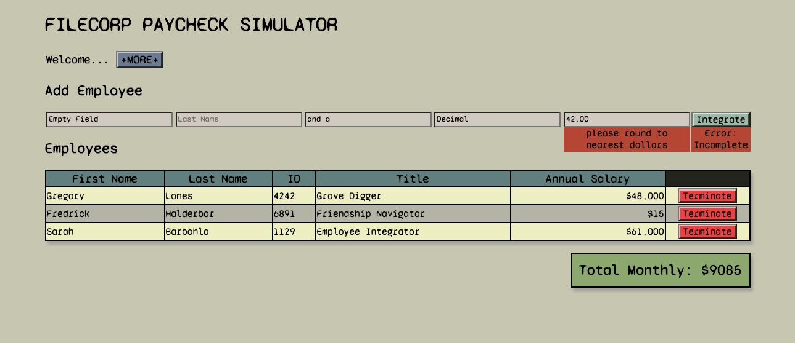
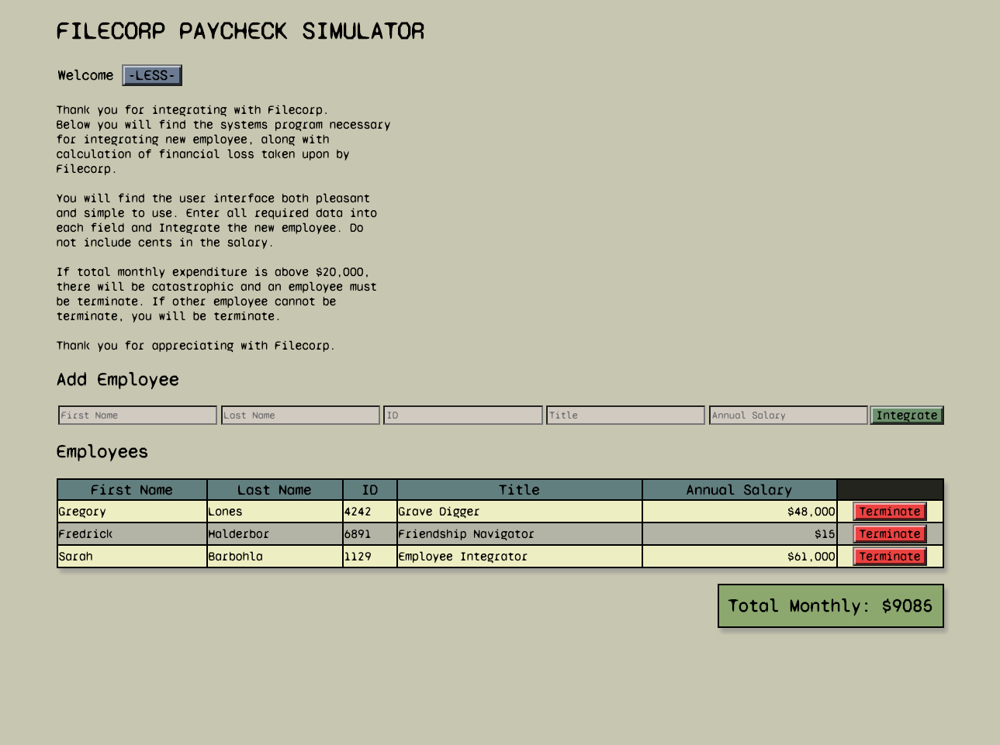

# jQuery Monthly Salary calculator

## Description

_Duration: Weekend_

Filecorp Paycheck Simulator takes data about an employee and adds it to a table diplayed on screen. The salary is taken and added to the total of all employees, then divided into the monthly cost for the companny which is displayed at the bottom. If the monthly total is above $20k, the total background will turn red. Error flags will show up if text boxes are not filled in correctly.

## Screen Shots

## Installation

open index.html in the browser

## Usage

1. Click "more" to see your welcome letter
2. Enter employee data to text boxes
3. Click "Integrate" to submit the new employee
4. Click "Terminate" next to an employee to remove them

## Built With

HTML, CSS, JavaScript, jQuery

## License
[MIT](https://choosealicense.com/licenses/mit/)

## Acknowledgement
Thanks to [Prime Digital Academy](www.primeacademy.io) who equipped and helped me to make this application a reality. Thank you to my wife for letting me take the time to do this, and thank you for boring offices who inspired this theme.

## Support
If you have suggestions or issues, please email me at jrmicko5012@gmail.com